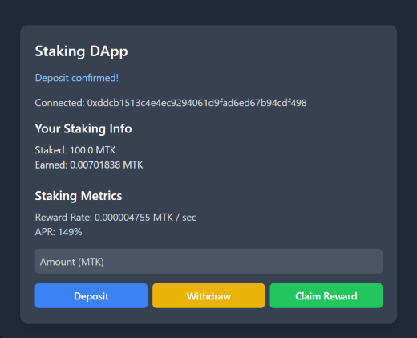

# MyToken DApp (ERC-20 + Staking)

MyToken DApp is a full-stack Web3 learning project built with Solidity, Hardhat,
React, and Ethers.js, deployed on the Sepolia testnet.

## Project Overview

This full-stack Web3 learning DApp implements:

- An original ERC-20 token (MyToken / MTK)
- A staking smart contract that allows users to stake MTK and earn rewards over time
- A React frontend connected to MetaMask for both token and staking interactions

## Implemented Features

### 1. Smart Contracts (Solidity / Hardhat)

#### ERC-20 Token (MyToken / MTK)
- Standard ERC-20 implementation using OpenZeppelin
- Token transfer, approve, transferFrom
- Deployed to Sepolia testnet

#### Staking Contract
- Stake and withdraw MTK tokens
- Claim time-based rewards
- Reward calculation using `block.timestamp`
- Configurable reward rate
- Total staked amount tracking

### 2. Frontend (React + Ethers.js)

- MetaMask wallet connection
- Token balance display
- Token transfer / approve / transferFrom UI
- Staking UI (deposit, withdraw, claim)
- Real-time earned reward display
- Reward rate and APR display
- Automatic UI refresh after transactions

## UI
Transfer Screen (includes balance):


Approve & TransferFrom Screens:


Staking Dashboard:



## Demo (ERC-20 Token Interaction)
Experience the DApp in action:

[▶ Watch ERC-20 Demo Video](https://drive.google.com/file/d/19AXhDnYnS7KKHGm_RAzbQFkGaHcqWqB0/view?usp=drivesdk)

*Note: The video shows wallet connection, balance check, transfer, approve, and transferFrom on Sepolia testnet.*

## Tech Stack

### Smart Contract
- Solidity
- Hardhat
- OpenZeppelin

### Frontend
- React
- Vite
- TailwindCSS
- Ethers.js
- MetaMask

## How to Run

1. Smart Contract Setup
```bash
npm install
# Deploy ERC-20 token first
npx hardhat run scripts/deploy.js --network sepolia
# Deploy staking contract with token address
npx hardhat run scripts/deploy_staking.js --network sepolia
```

2. Frontend Setup
```bash
cd frontend
npm install
npm run dev
```

## Learning Outcomes

- Interaction between smart contracts and frontend
- Implementing Web3 UI connected to MetaMask
- Using Ethers.js to fetch balances and send tokens
- Deploying smart contracts on a testnet using Hardhat
- Implementing staking logic and reward distribution
- Handling time-based rewards and on-chain state updates