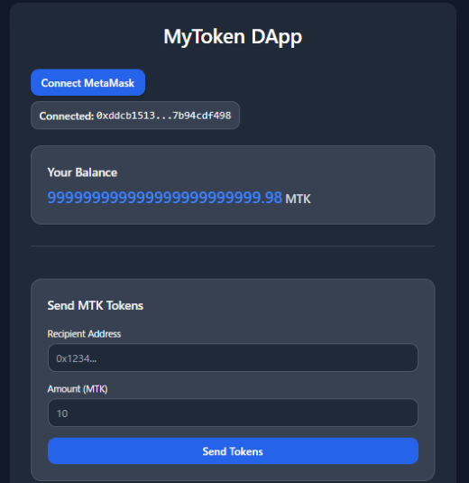
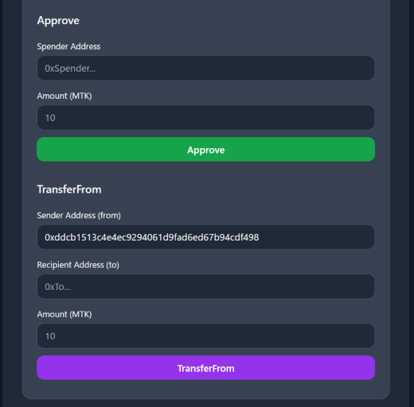

# MyToken DApp (ERC-20)

MyToken DApp is a simple ERC-20 Web3 application that allows users to connect MetaMask, check balances, and transfer tokens on Sepolia testnet.  
It combines Solidity + Hardhat for the smart contract and React + Ethers.js for the frontend.

## Project Overview

This full-stack Web3 learning DApp implements an ERC-20 token (MyToken / MTK) and a React frontend.
All core features (wallet connection, balance display, token transfer, approve, transferFrom) have been implemented.

## Implemented Features

### 1. Smart Contract (Solidity / Hardhat)

- Original ERC-20 token: MyToken (MTK)
- Compiled and deployed locally using Hardhat
- Deployed to Sepolia testnet
- Utilizes OpenZeppelin library

### 2. Frontend (React + Ethers.js)

- MetaMask wallet connection
- Display of current wallet address
- Fetching MyToken balance
- Token transfer (transfer)
- Approve a spender (approve)
- Transfer tokens from an approved account (transferFrom)
- Simple UI built with React + TailwindCSS

## UI
Transfer Screen (includes balance):



Approve & TransferFrom Screens:



## Demo
Experience the DApp in action:

<p align="center">
  <a href="https://drive.google.com/file/d/19AXhDnYnS7KKHGm_RAzbQFkGaHcqWqB0/view?usp=drivesdk" style="background-color:#4f46e5;color:white;padding:10px 20px;border-radius:8px;text-decoration:none;font-weight:bold;">Watch Demo Video</a>
</p>

*Note: The video shows wallet connection, balance check, transfer, approve, and transferFrom on Sepolia testnet.*

## Tech Stack

### Smart Contract
- Solidity
- Hardhat
- OpenZeppelin

### Frontend
- React
- Vite
- TailwindCSS
- Ethers.js
- MetaMask

## How to Run

1. Smart Contract Setup
```bash
npm install
npx hardhat run scripts/deploy.js --network sepolia
```

2. Frontend Setup
```bash
cd frontend
npm install
npm run dev
```

## Learning Outcomes

- Interaction between smart contracts and frontend
- Implementing Web3 UI connected to MetaMask
- Using Ethers.js to fetch balances and send tokens
- Deploying smart contracts on a testnet using Hardhat